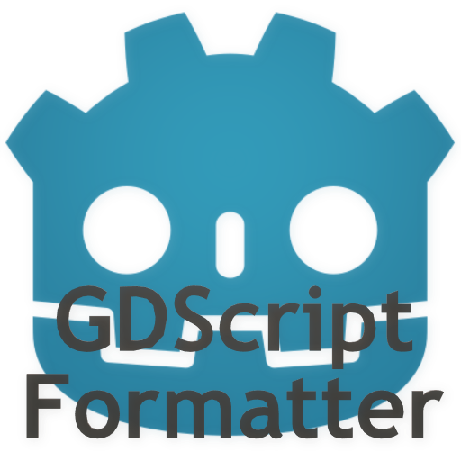

# GDScript Formatter

Click here to [English README](README.md).

一个用于格式化GDSCript脚本的Godot4.x插件。

## 特性

- 使用**快捷键**进行脚本格式化
  - 默认快捷键为**Shift+Alt+F**
- 保存脚本时自动格式化
  - 默认关闭，通过[编辑偏好设置](#偏好设置)进行开启。
- 通过**工具菜单**进行格式化
  - **项目 -> 工具 -> GDScript Formatter: Format script**
- 通过**命令面板**进行格式化
  - 打开命令面板(默认快捷键为**Ctrl+Shift+P**)并运行命令`Format GDScript`。

## 安装

**GDScript Formatter**依赖于[**GDToolkit**](https://github.com/Scony/godot-gdscript-toolkit)。如果你没有自行安装**GDToolKit**，可使用本插件**安装/更新GDToolkit**的功能，这需要你先自行安装**Pip**（通过安装**Python**获得），具体步骤如下：

1. 安装Pythin（如果你没有安装的话）
   - 从 [https://www.python.org/downloads/] 下载Python安装包。
   - 确保在安装时开启了"**Add python.exe to PATH**"选项
     - 如果你忘记开启该选项，亦可[在安装之后将"python.exe"添加到PATH中](https://realpython.com/add-python-to-path/)
   - **Pip**将被包含在**Python**中。

2. 在你的Godot项目中安装"**GDScript Formatter**"插件
   - 在Godot编辑器中，点击"AssetLib"并搜索"GDScript Formatter"
   - 安装该插件
   - 通过**项目 -> 项目设置 -> 插件**开启"GDScript Formatter"

3. 安装GDToolkit
   - **项目 -> 工具 -> GDScript Formatter: Install/Update gdtoolkit**

    **注意：如果你的Python仅为部分部分用户安装，可能需要前往[编辑偏好设置](#偏好设置)修改命令。**

## 偏好设置

你可以通过编辑偏好设置文件修改**GDScript Formatter**的行为。偏好设置是一个资源，被保存于`res://addons/gdscript_formatter/format_preference.tres`。通过双击这个文件，可在检查器中更改设置，其中包括格式化时每行的最大长度，是否开启保存时自动格式化，快捷键，实际使用的pip命令，实际使用的gdformat命令等。**在修改后记得保存该资源文件**。

## 其他

如果这个插件能帮到你还请为我[充电](https://afdian.net/a/Daylily-Zeleen)，我也会尽力推出新的插件和维护老的插件。
